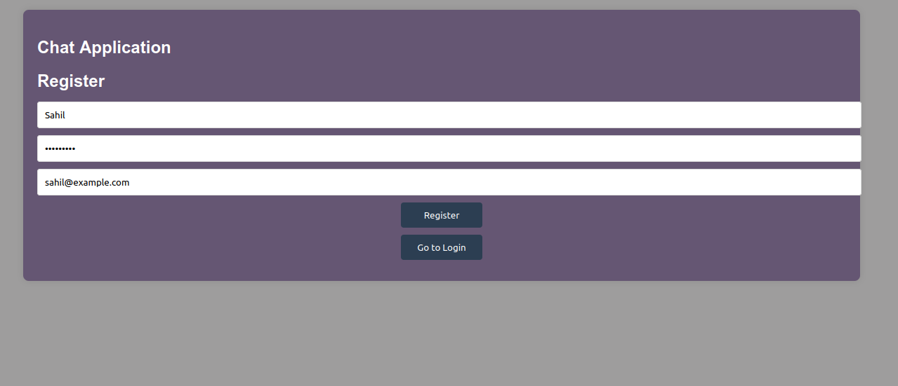
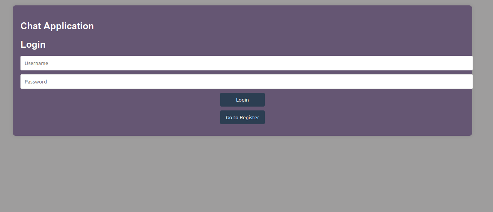
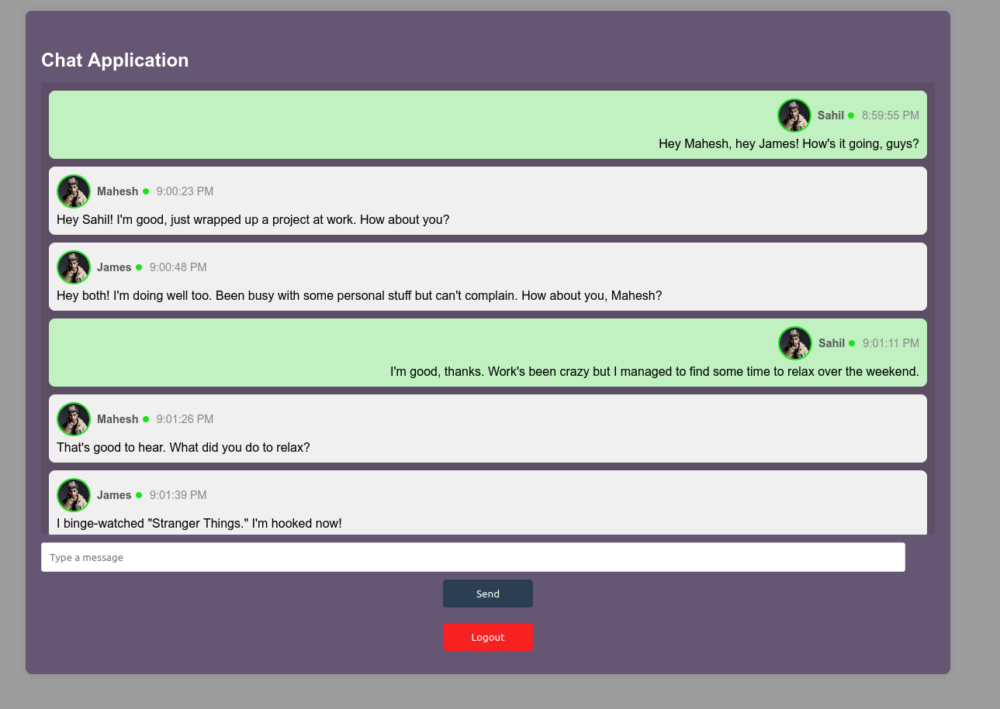

# Simple Chat Application

### Overview
* This is a simple chat application that uses WebSockets for real-time communication and MongoDB for user authentication and storing chat history. Users can register, log in, and participate in a real-time chat with other authenticated users.

### Features
* User Registration and Authentication
* Real-time Messaging
* Message Handling with Timestamps
* Simple and Intuitive User Interface

### Tech Stack
*   Backend - Nodejs
*   Frontend - HTML, CSS, JavaScript

## Setup Instructions
### Prerequisites

* Node.js and npm installed
* MongoDB installed and running

### So to bootstrap this chat-app locally on your machine, follow the steps below.

* Clone the project locally using this command
```bash
git clone https://github.com/Sahildarunde/chat-app.git
```
* Do install packages in client & server using
```bash
cd server 
npm install

cd client
npm install
```

* Now create .env file in server folder and include below code there
```bash
JWT_SECRET=chat-app
MONGODB_URI=mongodb://localhost:27017/chat-app
```

* To run the mongodb locally use docker
```bash
sudo docker run --name chat-app -d -p 27017:27017 mongo 
```

* Also install http-server globally or use live server to run client side code
```bash
npm install -g http-server
```

* To run the client side code
```bash
cd client
npm start

OR


```

* To run server side code
```bash
cd server
npm start
```

* After doing these steps you'll be able to access the client at 
```bash
http://localhost:8080 - if you're using http-server 

OR

http://localhost:5500 - if you're using live server
```


* To access server from postman 
```bash
http://localhost:3000/register
http://localhost:3000/login
```


### Backend (Node.js)
* **models/User.js** -  Defines the User schema and handles password hashing.
* **controllers/authController.js**: Contains functions for user registration and login.
* **routes/authRoutes.js**: Defines the routes for user authentication.
* **app.js**: Sets up the Nodejs app and routes.
* **server.js**: Sets up the HTTP and WebSocket server.


### Frontend 
* **index.html**: The main HTML file for the client.
* **styles.css**: The CSS file for styling the client.
* **app.js**: The JavaScript file for client-side logic and WebSocket handling.

### Authentication
#### User Registration
* Users register by providing a username, password, and email. Passwords are hashed before being stored in the database.

#### User Login
* Users log in by providing their username and password. A JWT token is generated for authenticated users.

### WebSocket Implementation
* WebSockets are used for real-time communication between clients.
* The WebSocket server is created and integrated with the HTTP server.

### Usage
* Register a new user.
* Log in with the registered credentials.
* Open the chat application and start messaging in real-time.


## Screenshots

#### Register User




#### Login User



#### Chat With Friends


